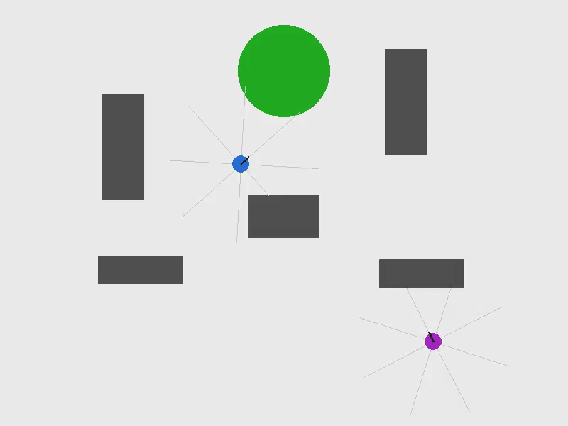
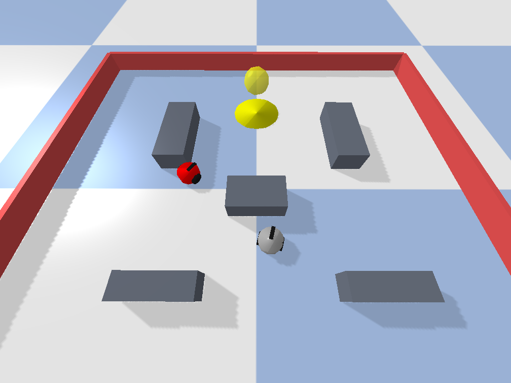

# Evolved Social Signaling in Cooperative Foraging Robots: From 2D to Physically Embodied 3D

<table>
  <tr>
    <td align="center">
      <br/>
      <b>2D Simulation</b>
    </td>
    <td align="center">
      <br/>
      <b>3D Simulation</b>
    </td>
  </tr>
</table>

This repository contains the code used to train, evaluate, and diagnose
evolved GRU-based controllers with social signaling in a two-robot
cooperative foraging task, in both a discrete 2D grid simulator and a
physics-based 3D simulator (PyBullet).

## Overview

Two robots ("slot A" and "slot B") coevolve a shared foraging task in
which one signaling channel can be used to communicate the location of
a food source. The controller architecture combines a recurrent (GRU)
pathway with memory and a residual pathway that connects the input
directly to the output logits. A fixed instinct layer ("basal ganglia")
provides bootstrap behaviors (recruitment signaling, stuck-escape,
anti-fixation annealing) on top of the learned policy.

This codebase supports two simulation backends:
- **2D**: a discrete grid world, no physics engine.
- **3D**: a continuous physics simulation built on PyBullet.

## Requirements

- Python 3.9+
- `numpy`
- `pygame` (2D rendering)
- `gymnasium` (2D environment API)
- `numba` (2D environment acceleration)
- `pybullet` (3D physics engine)
- `scipy` (statistical tests in diagnostic scripts)

Install with:
```bash
pip install numpy pygame gymnasium numba pybullet scipy
```

## Repository structure

```
controllers.py                 # Controller architectures (2D GRUController, 3D Unified3DController)
foraging_env.py                # 2D discrete environment
foraging_env3d.py              # 3D physics environment (PyBullet)
evaluate3d.py                  # Fitness evaluation for 3D evolutionary training
train_social.py                # 2D evolutionary training entry point
train_social3d.py              # 3D evolutionary training entry point
essim2d.py                     # 2D interactive visualizer
essim3d.py                     # 3D interactive visualizer (PyBullet GUI)
test_physics_gru.py            # Batch evaluation harness (success rate, --mute_social ablation)
test2d_reverse_order.py        # Processing-order control (2D)
compare_weights_ab.py          # Trained-weight comparison between slot A and slot B
diagnose_signal_effect_windowed3d.py  # Signal-effect diagnostic (3D)
diagnose_signal_effect_windowed2d.py  # Signal-effect diagnostic (2D)
caracterizacion_baseline_v15.sh       # Full baseline characterization battery (3D)
epuck.json                     # Robot / physics configuration
random_obstacles.json          # World layout used for evaluation
models/                        # Trained checkpoints (JSON weight files)
```

## Training a controller from scratch

**3D:**
```bash
python3 train_social3d.py --gen 150 --pop 32 --eval_repeats 3 --name my_run
```

**2D:**
```bash
python3 train_social2d.py --gen 150 --pop 128 --name my_run
```

Both accept `--load <checkpoint.json>` to continue evolving from an
existing checkpoint instead of starting from random weights.

## Visualizing a trained controller

**3D** (GRU or Braitenberg, auto-detected from filename):
```bash
python3 essim3d.py --controller social3d_v15_full_final.json --world random_obstacles --physics slippery
python3 essim3d.py --controller braitenberg_avoidance.json --world random_obstacles --physics slippery
```

**2D:**
```bash
python3 essim2d.py --model models/social2d_emergence.json --agents 2 --render --episodes 5
python3 essim2d.py --model braitenberg_avoidance.json --type braitenberg --agents 1 --render --episodes 5
```

## Reproducing the paper's results

**Official baseline (success rate, active vs. muted signal):**
```bash
bash caracterizacion_baseline_v15.sh 6000
```

**Weight asymmetry analysis (slot A vs. slot B):**
```bash
python3 compare_weights_ab.py --model models/social3d_v15_full_final.json
```

**Signal-effect (unsticking) diagnostic:**
```bash
python3 diagnose_signal_effect_windowed.py --model models/social3d_v15_full_final.json --episodes 150
```

**Processing-order control (rules out physics-engine artifacts):**
```bash
python3 test_physics_gru.py --model models/social3d_v15_full_final.json --episodes 300 --world random_obstacles --physics slippery --reverse_order
python3 test_2d_reverse_order.py --model models/social2d_emergence.json --episodes 300
```

## Official checkpoint

The results reported in the paper use `models/social3d_v15_full_final.json`
as the reference checkpoint, evaluated with a 6000-step episode budget.
See the paper's Methods section for the full list of independently
evolved checkpoints used in the weight-asymmetry analysis.

## Data availability

Raw data underlying the paper's figures and tables (weight ratios,
dose-response curve, unsticking-rate counts) are available upon
reasonable request to the authors.

## License

This project is licensed under the MIT License — see [LICENSE](LICENSE)
for details.
